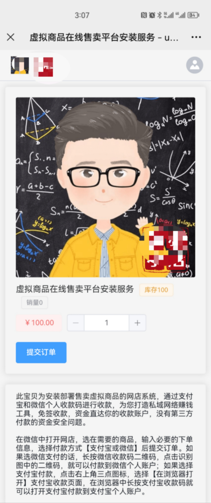
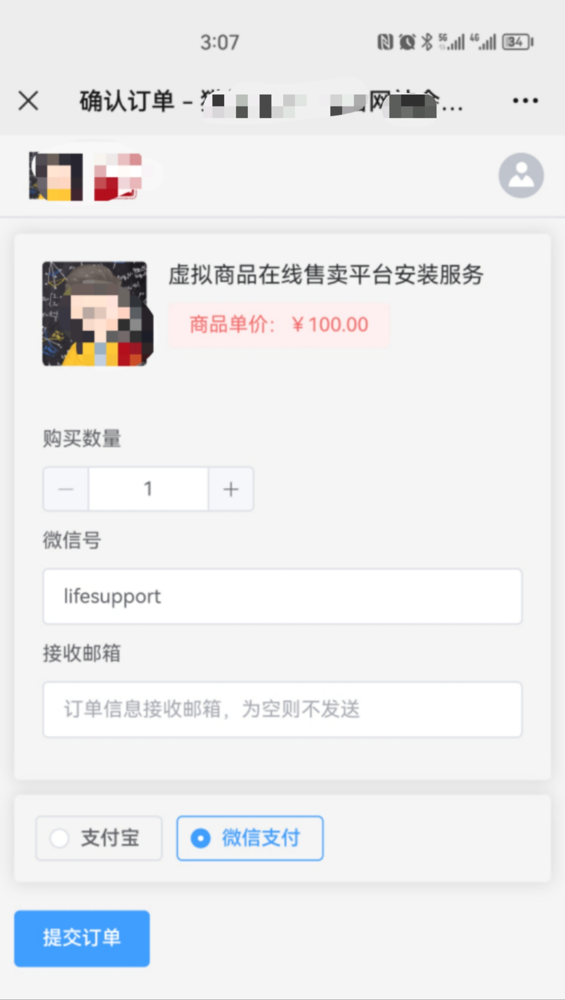
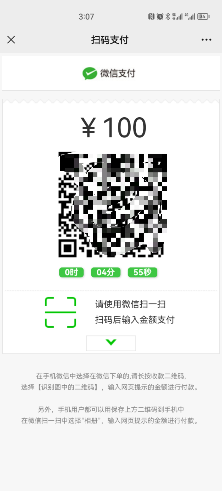
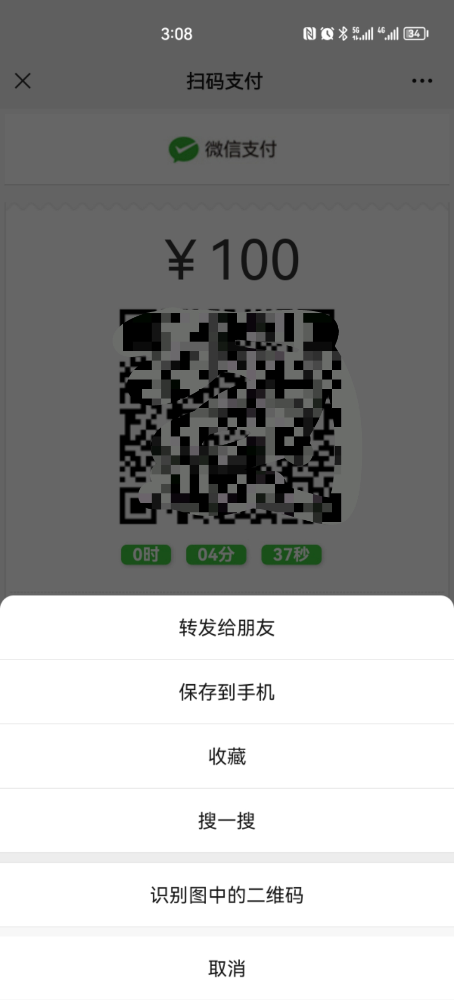
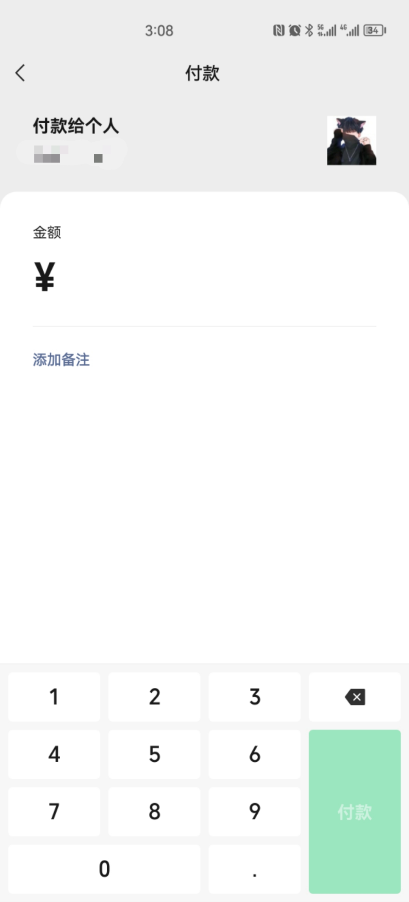

# pay
个人支付宝收款码 个人微信收款码 免签收款 网店收款 虚拟商品网店收款 网店系统

解决新版微信个人收款二维码在H5网页里不能长按识别支付 
微信8.0.16之前版本可以实现长按识别， 
之后的版本为了限制非当面交易， 
长按识别的地方显示一下，马上被屏蔽不见…… 
解决方法很简单，已在网店系统上线使用，有需要的可以联系（V信:lifesupport） 

完美解决微信浏览器内长按识别个人收款码 

-
-
-
-
-
